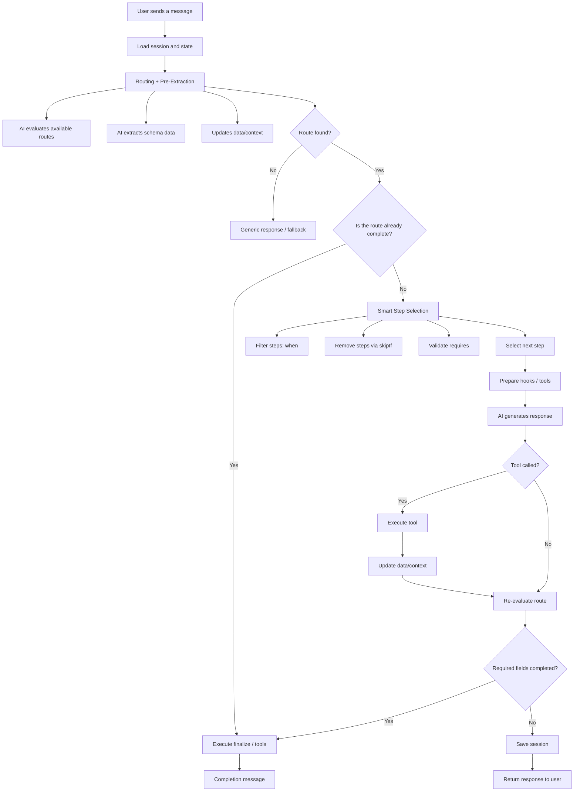
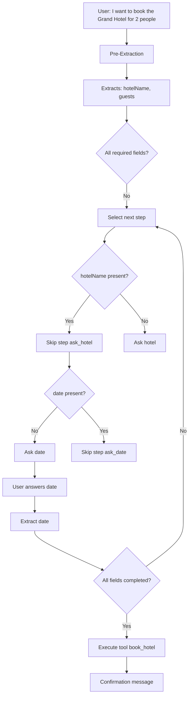

<div align="center">

# 🤖 @falai/agent

### Type-Safe AI Conversational Agents That Actually Work in Production

**@falai/agent is a conversational state engine where the AI understands, but the code is in control.**

**Schema-driven data extraction • Predictable conversations • Enterprise-ready**

[](https://www.typescriptlang.org/)
[](./LICENSE)
[](https://bun.sh)
[](https://falai.dev)

[🌐 Website](https://falai.dev) • [Features](#-features) • [Installation](#-installation) • [Quick Start](#-quick-start) • [Documentation](#-documentation) • [Examples](#-examples)

</div>

---

## ⚡ The @falai/agent Difference

### Traditional AI Chat:

```typescript
// User: "I want to book the Grand Hotel for 2 people next Friday"
// AI: "Sure! Which hotel would you like?" // 😠 Asked already!
// User: "Grand Hotel"
// AI: "How many guests?"                 // 😠 You just told me!
// User: "2 people"
// AI: "What date?"                        // 😠 I said Friday!
```

### With @falai/agent:

```typescript
// User: "I want to book the Grand Hotel for 2 people next Friday"
// AI: "Perfect! Booking confirmed for 2 guests at Grand Hotel on Friday!" 
// ✅ Extracted all data from one message
// ✅ Skipped unnecessary steps
// ✅ Completed immediately
```

**No more repetitive questions. No more guessing what the AI will ask next.**

**Intelligent Pre-Extraction** - AI automatically captures ALL relevant data from user messages, then determines which step to start at based on what's missing.

---

## 🤔 Why @falai/agent?

After building production AI applications, we found existing solutions either:

- **Too unpredictable** - AI decides everything, including which tools to call (unreliable in production)
- **Too complex** - Heavy Python frameworks with massive dependencies
- **Too basic** - No structured data extraction or step management

@falai/agent gives you **predictable AI** - the creativity of LLMs with the reliability of code.

**The key insight:** Let AI do what it's good at (understanding intent, generating responses, extracting data), and let TypeScript handle the rest (step logic, tool execution, validation).

---

## 🌟 Features

<table>
<tr>
<td width="50%">

### 🎯 **Developer Experience**

- **Fully Type-Safe** - Generic `Agent<TContext>` with complete inference
- **Fluent API** - Chainable methods for elegant code
- **Modular Design** - Use what you need, when you need it

</td>
<td width="50%">

### 🚀 **Production Ready**

- **Robust Retry Logic** - Exponential backoff & backup models
- **AI Provider Strategy** - Pluggable backends (Claude, Gemini, OpenAI, OpenRouter)
- **Prompt Composition** - Sophisticated prompt building system

</td>
</tr>
<tr>
<td width="50%">

### 🛤️ **Data-Driven Conversations**

- **Intelligent Pre-Extraction** - Automatically extract data BEFORE entering steps
- **Schema-First Extraction** - Define data contracts with JSON Schema
- **Automatic Route Completion** - Routes complete when required fields are collected
- **Smart Step Skipping** - Skip steps whose data is already present
- **Always-On Routing** - Context-aware routing between different flows

</td>
<td width="50%">

### 🔧 **Tools & Data Integration**

- **Advanced Tool System** - Context-aware tools with data access and lifecycle integration
- **Dynamic Tool Calling** - AI can call tools during streaming responses
- **Tool Result Processing** - Tools update context and collected data automatically

</td>
</tr>
<tr>
<td width="50%">

### 💾 **Optional Persistence**

- **Auto-Save** - Automatically persist conversation data and progress
- **Extensible Adapters** - Use built-in (Prisma, Redis, etc.) or create your own
- **Custom DB Support** - Integrate with your existing database schemas

</td>
<td width="50%">

### 🎯 **Session-Aware Routing**

- **Always-On Routing** - Users can change their mind mid-conversation
- **Context Awareness** - Router sees current progress and collected data

</td>
</tr>
<tr>
<td width="50%">

### 🚀 **Advanced Features**

- **Streaming Responses** - Real-time response generation with tool execution
- **Lifecycle Hooks** - `prepare`/`finalize` functions or tools on steps, context/data update hooks
- **Sequential Steps** - Define linear conversation flows with `steps` array
- **Route Transitions** - Automatic flow transitions when routes complete
- **Smart Step Control** - `skipIf` and `requires` for data-driven flow control

</td>
<td width="50%">

### 🎨 **Behavioral Control**

- **Guidelines & Rules** - Define agent behavior patterns and restrictions
- **Route-Specific Logic** - Different rules for different conversation contexts
- **Knowledge Base** - Structured information available to AI during responses
- **Session Step** - Track conversation progress across turns

</td>
</tr>
</table>

---

## 📦 Installation

```bash
# Using bun (recommended)
bun add @falai/agent

# Using npm
npm install @falai/agent

# Using yarn
yarn add @falai/agent
```

> **Requirements:** Node.js 18+ or Bun 1.0+

---

## 🚀 Quick Start

### Level 1: Your First Agent (30 seconds)

Create a minimal conversational agent:

```typescript
import {
  Agent,
  GeminiProvider,
  createMessageEvent,
  EventSource,
} from "@falai/agent";

// Create your agent
const agent = new Agent({
  name: "Assistant",
  description: "A helpful assistant",
  provider: new GeminiProvider({
    apiKey: process.env.GEMINI_API_KEY!,
    model: "models/gemini-2.5-flash",
  }),
});

// Create a simple route with sequential steps
agent.createRoute({
  title: "General Help",
  description: "Answers user questions",
  when: ["User needs help or asks a question"],
  steps: [
    {
      id: "answer_question",
      description: "Answer the user's question helpfully",
      prompt: "Answer the user's question helpfully",
    },
  ],
});

// Start chatting - simple message-based API
const response = await agent.respond("What can you do?");

console.log(response.message);
```

**That's it!** You now have a working conversational AI agent.

---

## 🎯 Advanced Routing with ConditionTemplate

### Flexible Route Conditions

Routes now support powerful condition patterns that combine AI context with programmatic logic:

```typescript
// String-only conditions (AI context for routing decisions)
agent.createRoute({
  title: "Customer Support",
  when: "User needs help with their account",
  steps: [/* ... */]
});

// Function-only conditions (programmatic evaluation)
agent.createRoute({
  title: "Premium Features",
  when: (ctx) => ctx.data?.userType === 'premium',
  steps: [/* ... */]
});

// Mixed array conditions (AI context + programmatic logic)
agent.createRoute({
  title: "Booking Assistance",
  when: [
    "User wants to make a reservation", // AI context
    (ctx) => ctx.data?.isLoggedIn === true // Programmatic check
  ],
  steps: [/* ... */]
});

// Route skipIf - exclude routes dynamically
agent.createRoute({
  title: "Payment Processing",
  when: ["User wants to make a payment"],
  skipIf: [
    "Payment system is under maintenance", // AI context
    (ctx) => ctx.data?.paymentBlocked === true // Programmatic check
  ],
  steps: [/* ... */]
});
```

### Enhanced Step Conditions

Steps support the same flexible condition patterns:

```typescript
agent.createRoute({
  title: "Order Process",
  steps: [
    {
      id: "collect_items",
      when: "User wants to add items to cart",
      prompt: "What would you like to order?",
      collect: ["items"]
    },
    {
      id: "payment_step",
      when: [
        "Ready to process payment", // AI context
        (ctx) => ctx.data?.items?.length > 0 // Programmatic check
      ],
      skipIf: (ctx) => ctx.data?.paymentComplete === true,
      prompt: "Let's process your payment",
      tools: ["process_payment"]
    },
    {
      id: "confirmation",
      when: "Order is ready for confirmation",
      skipIf: [
        "Order already confirmed", // AI context
        (ctx) => ctx.data?.orderConfirmed === true // Programmatic check
      ],
      prompt: "Your order is confirmed!",
      finalize: "send_confirmation_email"
    }
  ]
});
```

### Dynamic Guidelines

Guidelines now support flexible conditions for context-aware behavior:

```typescript
// Add guidelines with mixed condition types
agent.addGuideline({
  title: "Premium User Support",
  condition: [
    "User is asking for help", // AI context
    (ctx) => ctx.data?.userType === 'premium' // Programmatic check
  ],
  content: "Provide priority support with detailed explanations and offer direct phone support."
});

agent.addGuideline({
  title: "Maintenance Mode",
  condition: "System maintenance is active",
  content: "Inform users about scheduled maintenance and provide estimated completion time."
});

// Function-only guideline for specific conditions
agent.addGuideline({
  title: "High Value Customer",
  condition: (ctx) => ctx.data?.totalSpent > 10000,
  content: "Offer VIP treatment and exclusive deals."
});
```

**Key Benefits:**

- ✅ **Hybrid Logic** - Combine AI understanding with programmatic precision
- ✅ **Context Awareness** - AI sees string conditions for better routing decisions
- ✅ **Performance** - Functions execute first, strings only used when needed
- ✅ **Flexibility** - Use simple strings, functions, or arrays as needed

---

## 🔧 Advanced Step Configuration

### Simple Tool Creation

Create tools with minimal boilerplate using the unified Tool interface:

```typescript
// Create a simple tool with the unified interface
agent.addTool({
  id: "validate_user",
  name: "User Data Validator",
  description: "Validate user data before processing",
  parameters: { type: "object", properties: {} },
  handler: async ({ context, data, updateData }) => {
    // Validation logic with helper methods
    if (!data.email?.includes("@")) {
      throw new Error("Invalid email address");
    }
    
    // Mark as validated using helper method
    await updateData({ emailValidated: true });
    
    return "User validation completed successfully";
  },
});

// Use tools in conversation flows and step lifecycle
agent.createRoute({
  title: "User Registration",
  steps: [
    {
      id: "collect_info",
      description: "Collect user information",
      collect: ["name", "email"],
      prompt: "Please provide your name and email.",
      prepare: "validate_user", // Tool executes before AI response
      tools: ["validate_user"], // Tool available during conversation
    },
  ],
});
```

**Benefits:**

- ✅ **Simple API** - Unified Tool interface with minimal complexity
- ✅ **Type Safety** - Full TypeScript support with automatic inference
- ✅ **Flexible Returns** - Return simple values or complex ToolResult objects
- ✅ **Helper Methods** - Built-in context and data update utilities
- ✅ **Lifecycle Integration** - Use tools as prepare/finalize hooks in steps

---

### Level 2: Data Extraction (The Real Power)

Now let's build an agent that intelligently collects structured data:

```typescript
import {
  Agent,
  OpenAIProvider,
  createMessageEvent,
  EventSource,
} from "@falai/agent";

// 1️⃣ Define the data you want to collect
interface HotelBookingData {
  hotelName: string;
  date: string;
  guests: number;
}

// 2️⃣ Create your agent with centralized data schema
const agent = new Agent<{}, HotelBookingData>({
  name: "BookingBot",
  description: "A hotel booking assistant that collects information.",
  provider: new OpenAIProvider({
    apiKey: process.env.OPENAI_API_KEY,
    model: "gpt-4", // or your preferred model
  }),
  
  // Agent-level schema defines all possible data fields
  schema: {
    type: "object",
    properties: {
      hotelName: { type: "string", description: "The name of the hotel." },
      date: { type: "string", description: "The desired booking date." },
      guests: { type: "number", description: "The number of guests." },
    },
    required: ["hotelName", "date", "guests"],
  },
  
  // Agent-level data validation and enrichment
  hooks: {
    onDataUpdate: async (data, previousData) => {
      // Auto-validate and enrich data
      if (data.guests && data.guests > 10) {
        throw new Error("Maximum 10 guests allowed");
      }
      return data;
    }
  }
});

// 3️⃣ Define a tool using the unified Tool interface
agent.addTool({
  id: "book_hotel",
  name: "Hotel Booking System",
  description: "Books a hotel once all information is collected.",
  parameters: { type: "object", properties: {} },
  handler: async ({ context, data, updateContext }) => {
    // Tool receives complete agent data with simplified context and helper methods
    const bookingId = await hotelAPI.createBooking({
      hotel: data.hotelName,
      date: data.date,
      guests: data.guests,
    });
    
    // Use helper method to update context
    await updateContext({
      lastBookingId: bookingId,
      lastBookingDate: new Date().toISOString(),
    });
    
    return `Booking confirmed! Confirmation #${bookingId} for ${data.guests} guests at ${data.hotelName} on ${data.date}`;
  },
});

// 4️⃣ Create a route with required fields specification
agent.createRoute({
  title: "Book Hotel",
  description: "Guides the user through the hotel booking process.",
  when: ["User wants to book a hotel"],
  requiredFields: ["hotelName", "date", "guests"], // Required for route completion
  
  // 5️⃣ Define the flow to collect data step-by-step
  steps: [
    {
      id: "ask_hotel",
      description: "Ask which hotel they want to book",
      prompt: "Which hotel would you like to book?",
      collect: ["hotelName"],
      skipIf: (data: Partial<HotelBookingData>) => !!data.hotelName,
    },
    {
      id: "ask_date",
      description: "Ask for the booking date",
      prompt: "What date would you like to book for?",
      collect: ["date"],
      requires: ["hotelName"], // Prerequisites from agent data
      skipIf: (data: Partial<HotelBookingData>) => !!data.date,
    },
    {
      id: "ask_guests",
      description: "Ask for the number of guests",
      prompt: "How many guests will be staying?",
      collect: ["guests"],
      requires: ["hotelName", "date"], // Prerequisites from agent data
      skipIf: (data: Partial<HotelBookingData>) => data.guests !== undefined,
    },
    {
      id: "confirm_booking",
      description: "Confirm and book the hotel",
      prompt: "Let me confirm your booking details.",
      tools: ["book_hotel"], // Reference tool by ID
      requires: ["hotelName", "date", "guests"],
    },
  ],
});

// 5️⃣ Start conversing - simple message API
const response = await agent.respond("I want to book a room at the Grand Hotel for 2 people.");

// The agent sees that `hotelName` and `guests` are provided,
// skips the first and third steps, and only asks for the date.
console.log(response.message);
// Expected: "What date would you like to book for?"
```

**That's it!** The data-driven agent will:

- ✅ **Understand the Goal** - Route to the `Book Hotel` flow based on user intent.
- ✅ **Extract Known Data** - Automatically pull `hotelName` and `guests` from the first message.
- ✅ **Skip Unneeded Steps** - Use `skipIf` to bypass questions for data it already has.
- ✅ **Collect Missing Data** - Intelligently ask only for the missing `date`.
- ✅ **Execute Deterministically** - Call the `bookHotel` tool only when all required data is present.

This creates a flexible and natural conversation, guided by a clear data structure.

📖 **[See more examples →](./examples/)** | **[Full tutorial →](./docs/guides/getting-started/README.md)**

### ⚡ Advanced Features

**Streaming responses** for real-time UX:

```typescript
for await (const chunk of agent.respondStream("Hello")) {
  process.stdout.write(chunk.delta);
  if (chunk.done) {
    console.log("\nTool calls:", chunk.toolCalls);
  }
}
```

**Automatic session management** for multi-turn conversations:

```typescript
// Server-side: Create agent with sessionId
const agent = new Agent({
  name: "Assistant",
  provider: new OpenAIProvider({ apiKey: process.env.OPENAI_API_KEY }),
  persistence: { adapter: new PrismaAdapter({ prisma }) },
  sessionId: "user-123" // Automatically loads or creates session
});

// Simple conversation - no manual session management needed
const response = await agent.respond("Hello, how are you?");
console.log(response.message);
console.log(agent.session.id); // Session ID for client
```

**Automatic session persistence** with any adapter:

```typescript
import { PrismaAdapter } from "@falai/agent";

// Server endpoint - sessions managed automatically
app.post('/chat', async (req, res) => {
  const { sessionId, message } = req.body;
  
  const agent = new Agent({
    name: "ChatBot",
    provider: new OpenAIProvider({ apiKey: process.env.OPENAI_API_KEY }),
    persistence: { adapter: new PrismaAdapter({ prisma }) },
    sessionId // Automatically loads or creates this session
  });
  
  const response = await agent.respond(message);
  
  res.json({
    message: response.message,
    sessionId: agent.session.id, // Return session ID to client
    isComplete: response.isRouteComplete
  });
});
```

📖 **[See full feature docs →](./docs)**

---

## 📚 Documentation

📋 **[Complete Documentation Index →](docs/README.md)** - Searchable index of all docs

### 🚀 Getting Started

- **[Quick Start Guide](./docs/guides/getting-started/README.md)** - Build your first agent in 15 minutes

### 🏗️ Core Framework

- **[Agent Orchestration](./docs/core/agent/README.md)** - Agent lifecycle, configuration & hooks
- **[Context Management](./docs/core/agent/context-management.md)** - Dynamic context providers & updates
- **[Session Management](./docs/core/agent/session-management.md)** - Session persistence & state

### 💬 Conversation Flows

- **[Routes](./docs/core/conversation-flows/routes.md)** - Route definition & lifecycle
- **[Steps](./docs/core/conversation-flows/steps.md)** - Step transitions & logic

### 🏗️ Architecture

- **[Multi-Step Execution](./docs/architecture/multi-step-execution.md)** - Batch execution architecture & flow

### 🤖 AI Integration

- **[AI Providers](./docs/core/ai-integration/providers.md)** - Gemini, OpenAI, Anthropic, OpenRouter
- **[Prompt Composition](./docs/core/ai-integration/prompt-composition/)** - How prompts are built
- **[Response Processing](./docs/core/ai-integration/response-processing/)** - Schema extraction & tool calls

### 🔧 Tools & Data

- **[Tool Definition](./docs/core/tools/tool-definition.md)** - Creating and configuring tools
- **[Tool Execution](./docs/core/tools/tool-execution.md)** - Dynamic tool calling and context updates
- **[Tool Scoping](./docs/core/tools/tool-scoping.md)** - Agent, route, and step-level tool management

### 💾 Persistence

- **[Session Storage](./docs/core/persistence/session-storage.md)** - Session persistence patterns
- **[Database Adapters](./docs/core/persistence/adapters.md)** - Built-in adapter configurations

### 🚀 Advanced Guides

- **[Building Agents](./docs/guides/building-agents/)** - Complete agent construction patterns
- **[Advanced Patterns](./docs/guides/advanced-patterns/)** - Complex use cases & integrations
- **[Multi-Step Execution Migration](./docs/guides/migration/multi-step-execution.md)** - Migrating to batch execution
- **[API Reference](./docs/api/overview.md)** - Complete API documentation

---

## 🎯 Examples - By Domain

### 🏗️ Core Concepts

Fundamental patterns every agent needs:

- **[Basic Agent](./examples/core-concepts/basic-agent.ts)** - Minimal agent setup and configuration
- **[Schema-Driven Extraction](./examples/core-concepts/schema-driven-extraction.ts)** - Type-safe data collection with JSON Schema
- **[Session Management](./examples/core-concepts/session-management.ts)** - Multi-turn conversations with persistence
- **[Context Providers](./examples/core-concepts/context-providers.ts)** - Dynamic context fetching and updates

### 💬 Conversation Flows

Building intelligent dialogue systems:

- **[Simple Route](./examples/conversation-flows/simple-route.ts)** - Basic route with linear step progression
- **[Data-Driven Flows](./examples/conversation-flows/data-driven-flows.ts)** - Conditional logic with skipIf and requires
- **[Conditional Branching](./examples/conversation-flows/conditional-branching.ts)** - AI-powered branching decisions
- **[Completion Transitions](./examples/conversation-flows/completion-transitions.ts)** - Route transitions when flows complete

### 🤖 AI Providers

Integrating different AI services:

- **[Gemini Integration](./examples/ai-providers/gemini-integration.ts)** - Google Gemini with advanced features
- **[OpenAI Integration](./examples/ai-providers/openai-integration.ts)** - GPT-4 and GPT-3.5 Turbo
- **[Anthropic Integration](./examples/ai-providers/anthropic-integration.ts)** - Claude with streaming and tool calling
- **[Custom Provider](./examples/ai-providers/custom-provider.ts)** - Build your own AI provider integration

### 💾 Persistence

Session storage and data persistence:

- **[Memory Sessions](./examples/persistence/memory-sessions.ts)** - In-memory session management
- **[Redis Persistence](./examples/persistence/redis-persistence.ts)** - High-performance Redis storage
- **[Database Persistence](./examples/persistence/database-persistence.ts)** - SQL/NoSQL database integration
- **[Custom Adapter](./examples/persistence/custom-adapter.ts)** - Build custom persistence adapters

### 🔧 Tools

Tool creation and data manipulation:

- **[Basic Tools](./examples/tools/basic-tools.ts)** - Simple tool creation and execution
- **[Data Enrichment Tools](./examples/tools/data-enrichment-tools.ts)** - Tools that modify collected data
- **[Context Updating Tools](./examples/tools/context-updating-tools.ts)** - Tools that modify agent context
- **[Domain Scoped Tools](./examples/tools/domain-scoped-tools.ts)** - Tool security and access control

### 🚀 Advanced Patterns

Complex use cases and integrations:

- **[Multi-Turn Conversations](./examples/advanced-patterns/multi-turn-conversations.ts)** - Complex dialogue flows with backtracking
- **[Streaming Responses](./examples/advanced-patterns/streaming-responses.ts)** - Real-time response streaming
- **[Route Lifecycle Hooks](./examples/advanced-patterns/route-lifecycle-hooks.ts)** - Custom route behavior
- **[Custom Response Schemas](./examples/advanced-patterns/custom-response-schemas.ts)** - Advanced schema patterns

### 🔗 Integrations

External service integrations:

- **[Server Deployment](./examples/integrations/server-deployment.ts)** - HTTP API with WebSocket streaming
- **[Database Integration](./examples/integrations/database-integration.ts)** - Direct database access patterns
- **[Webhook Integration](./examples/integrations/webhook-integration.ts)** - HTTP webhook handling
- **[API Integration](./examples/integrations/api-integration.ts)** - External API calls and responses

📖 **[See all examples with detailed explanations →](./examples/)**

---

## 🏗️ How It Works

`@falai/agent` uses a **schema-first, pipeline-driven architecture** with intelligent pre-extraction:

```
User Message + Session State
    ↓
┌─────────────────────────────────────────┐
│ 1. ROUTING + PRE-EXTRACTION             │
│    • Evaluate routes (AI scoring)       │
│    • Pre-extract data from message      │
│    • Check route completion             │
└─────────────────────────────────────────┘
    ↓
┌─────────────────────────────────────────┐
│ 2. SMART STEP SELECTION                 │
│    • Filter steps (skipIf, requires)    │
│    • Skip steps with existing data      │
│    • Select optimal next step           │
└─────────────────────────────────────────┘
    ↓
┌─────────────────────────────────────────┐
│ 3. RESPONSE GENERATION                  │
│    • Build prompt with context          │
│    • Generate AI response               │
│    • Execute tools if needed            │
└─────────────────────────────────────────┘
    ↓
┌─────────────────────────────────────────┐
│ 4. COMPLETION HANDLING                  │
│    • Auto-complete when data collected  │
│    • Exclude completed routes           │
│    • Generate completion message        │
└─────────────────────────────────────────┘
    ↓
Response + Updated Session State
```

### Key Principles:

✅ **AI decides:** Route selection, data extraction, message generation, tool calling
✅ **Code decides:** Step flow control, route completion, lifecycle hooks, data validation
✅ **Result:** Efficient conversations that don't waste user time

### What Makes It Smart:

🎯 **Pre-Extraction** - Data extracted BEFORE entering steps (no repeated questions)
🚀 **Auto-Completion** - Routes complete automatically when required fields are collected
🔒 **Completion Protection** - Completed routes excluded from future selection
⚡ **Smart Skipping** - Steps bypassed if their data is already present

📖 **[Read the detailed architecture →](./docs/architecture/data-extraction-flow.md)**

---

### 1️⃣ General flowchart of @falai/agent

This is the **actual internal execution flow** when `agent.respond()` is called.



### 🧠 Mental model of the flow

* **AI decides**
  → intent, route, data extraction, tools
* **Code decides**
  → step order, skipping steps, completing routes
* **Nothing is random**
  → there is always a deterministic next step

---

## 2️⃣ Data-Driven conversation flowchart (e.g. Booking)

This shows **why the framework does not ask repeated questions**.



---

## 🔑 Key concepts mapped in the flowchart

| README Concept    | Where it appears                     |
| ----------------- | ------------------------------------ |
| Pre-Extraction    | Before any step                      |
| skipIf            | Smart Step Selection                 |
| requires          | Validation before the step           |
| requiredFields    | Route completion check               |
| Tools             | During generation or finalize        |
| Session-aware     | State loaded at the beginning        |
| Always-on routing | Route re-evaluated after each action |

---

## 🤝 Contributing

We welcome contributions! See our [Contributing Guide](./docs/CONTRIBUTING.md) for details on:

- 🐛 Reporting bugs
- 💡 Suggesting features
- 📝 Improving documentation
- 🔨 Submitting pull requests

## 🎓 Inspired By

This framework draws inspiration from [**Parlant**](https://github.com/emcie-co/parlant) by Emcie Co., an excellent Python framework for conversational AI agents. We've adapted and enhanced these concepts for the TypeScript ecosystem with additional type safety and modern patterns.

---

## 📄 License

MIT © 2025

---

<div align="center">

## 🚀 Ready to Build?

**Choose your path:**

👶 **New to AI agents?** → [Quick Start Guide](./docs/guides/getting-started/README.md)
🏗️ **Building production app?** → [Agent Architecture](./docs/core/agent/README.md)
💡 **Have questions?** → [Open a discussion](https://github.com/falai-dev/agent/discussions)

---

### ⭐ Star us on [GitHub](https://github.com/falai-dev/agent)

**Help us reach more developers building production AI!**

[Report Bug](https://github.com/falai-dev/agent/issues) • [Request Feature](https://github.com/falai-dev/agent/issues) • [Contribute](https://github.com/falai-dev/agent/pulls)

**Made with ❤️ for the community**

</div>
