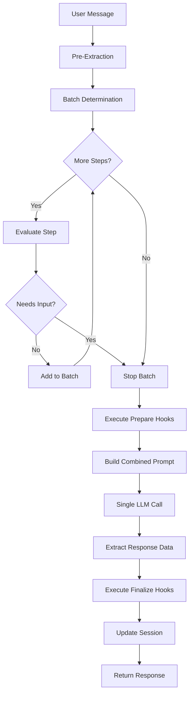

# Multi-Step Execution Architecture

## Overview

@falai/agent supports **multi-step execution**, enabling multiple consecutive Steps to execute in a single LLM call. This reduces unnecessary multi-turn conversations, minimizes LLM costs, and improves user experience when steps don't require new user input.

The core insight is simple: **if a Step's data requirements are already satisfied, there's no reason to pause and wait for user input**. By detecting which Steps can execute together and combining them into a single batch, we reduce LLM calls while improving conversation UX.

## Design Priorities

1. **Conversation UX** - Reduce unnecessary back-and-forth
2. **LLM Cost Optimization** - Fewer calls for the same outcome
3. **Predictability** - Clear, simple rules for when execution pauses
4. **Framework Understandability** - Keep the Step/Route mental model intact

## Batch Execution Flow



## Execution Phases

### Phase 1: Pre-Extraction

When processing a user message, the engine performs **pre-extraction** before determining the batch. This phase:

1. Attempts to extract data for all fields defined in the Route's `requiredFields` and `optionalFields`
2. Merges pre-extracted data into session data
3. Maximizes batching by satisfying Step requirements upfront

```typescript
// User: "I want to book the Grand Hotel for 2 people next Friday"

// Pre-extraction automatically captures:
{
  hotelName: "Grand Hotel",
  guests: 2,
  date: "next Friday"
}
```

### Phase 2: Batch Determination

The `BatchExecutor` walks through Steps using this algorithm:

```
For each Step starting from current position:
  a. Check if it's END_ROUTE → stop with 'end_route'
  b. Evaluate skipIf condition
  c. If skipIf is true → skip Step, continue to next
  d. If skipIf throws error → treat as non-skippable
  e. Evaluate needsInput(step, sessionDataAfterPreExtraction)
  f. If needsInput is false → include Step in batch, continue to next
  g. If needsInput is true → stop with 'needs_input'
```

### Phase 3: Hook Execution (Prepare)

Before the LLM call, all `prepare` hooks for batched Steps execute in Step order. If any prepare hook fails, batch execution stops immediately.

### Phase 4: LLM Call

A single LLM call is made with a combined prompt that includes all Step prompts and collect fields.

### Phase 5: Data Collection

All `collect` fields from all Steps in the batch are extracted from the LLM response and validated against the agent schema.

### Phase 6: Hook Execution (Finalize)

After the LLM response, all `finalize` hooks execute in Step order. Finalize hook failures are logged but don't stop execution.

## Needs-Input Detection Algorithm

The `needsInput` function implements the core execution rule:

```typescript
function needsInput<TData>(
  step: Step<unknown, TData>,
  sessionDataAfterPreExtraction: Partial<TData>
): boolean {
  // Check requires - all must be present (after pre-extraction)
  if (step.requires && step.requires.length > 0) {
    const missingRequired = step.requires.some(
      field => sessionDataAfterPreExtraction[field] === undefined
    );
    if (missingRequired) return true;
  }

  // Check collect - needs input if collecting and no data exists (after pre-extraction)
  if (step.collect && step.collect.length > 0) {
    const hasAnyCollectData = step.collect.some(
      field => sessionDataAfterPreExtraction[field] !== undefined
    );
    if (!hasAnyCollectData) return true;
  }

  return false;
}
```

A Step **needs input** when:

1. It has `requires` fields and at least one is missing from session data (after pre-extraction)
2. It has non-empty `collect` fields and none of those fields have data (after pre-extraction)

## Pre-Extraction's Role in Batching

Pre-extraction is critical for maximizing batch size. Consider this scenario:

```typescript
// Route with 3 steps
const route = agent.createRoute({
  title: "Booking",
  requiredFields: ["hotel", "date", "guests"],
  steps: [
    { prompt: "Which hotel?", collect: ["hotel"] },
    { prompt: "What date?", collect: ["date"] },
    { prompt: "How many guests?", collect: ["guests"] }
  ]
});

// User message: "Book Grand Hotel for 2 people on Friday"
```

**Without pre-extraction:**
- Step 1 needs input (no hotel data) → batch stops
- 3 separate LLM calls needed

**With pre-extraction:**
- Pre-extraction captures: `{ hotel: "Grand Hotel", date: "Friday", guests: 2 }`
- All steps have their data satisfied
- All 3 steps execute in a single batch
- 1 LLM call needed

## Key Components

### BatchExecutor

The core component responsible for:
- Determining which Steps can execute together (`determineBatch`)
- Executing prepare/finalize hooks (`executePrepareHooks`, `executeFinalizeHooks`)
- Collecting data from LLM responses (`collectBatchData`)
- Orchestrating complete batch execution (`executeBatch`)

### BatchPromptBuilder

Combines multiple Step prompts into a single coherent prompt:
- Preserves each Step's individual prompt intent
- Includes data collection instructions for all `collect` fields
- Produces a single LLM call regardless of Step count

## Example: Multi-Step Batch

```typescript
// User provides all booking info at once
const response = await agent.respond(
  "I want to book the Grand Hotel for 2 people next Friday"
);

// Response includes:
{
  message: "Perfect! I've booked the Grand Hotel for 2 guests on Friday.",
  executedSteps: [
    { id: "ask-hotel", routeId: "booking" },
    { id: "ask-date", routeId: "booking" },
    { id: "ask-guests", routeId: "booking" }
  ],
  stoppedReason: "route_complete",
  session: {
    data: {
      hotel: "Grand Hotel",
      date: "Friday",
      guests: 2
    }
  }
}
```

## Debugging

Enable debug mode to see batch execution decisions:

```typescript
const agent = new Agent({
  name: "Assistant",
  provider: provider,
  debug: true  // Enable detailed logging
});
```

Look for these log messages:

```
[BatchExecutor] Starting batch determination from step index 0
[BatchExecutor] Including step ask-hotel in batch (all requirements satisfied)
[BatchExecutor] Including step ask-date in batch (all requirements satisfied)
[BatchExecutor] Step ask-guests needs input, stopping batch
[BatchExecutor] Batch determination complete. Steps: 2, Stopped reason: needs_input
```

## Event Emission

The BatchExecutor emits events for observability:

- `batch_start` - When batch determination begins
- `step_included` - When a step is included in the batch
- `step_skipped` - When a step is skipped (due to skipIf)
- `batch_stop` - When batch determination stops
- `batch_complete` - When batch execution completes

```typescript
const executor = new BatchExecutor();

executor.addEventListener((event) => {
  console.log(`[${event.type}]`, event.details);
});
```

---

**Related Documentation:**
- [Steps](../core/conversation-flows/steps.md) - Step configuration and batching
- [Step Transitions](../core/conversation-flows/step-transitions.md) - Stopping conditions
- [Data Collection](../core/conversation-flows/data-collection.md) - Pre-extraction details
- [Prompt Composition](../core/ai-integration/prompt-composition.md) - Combined prompts
