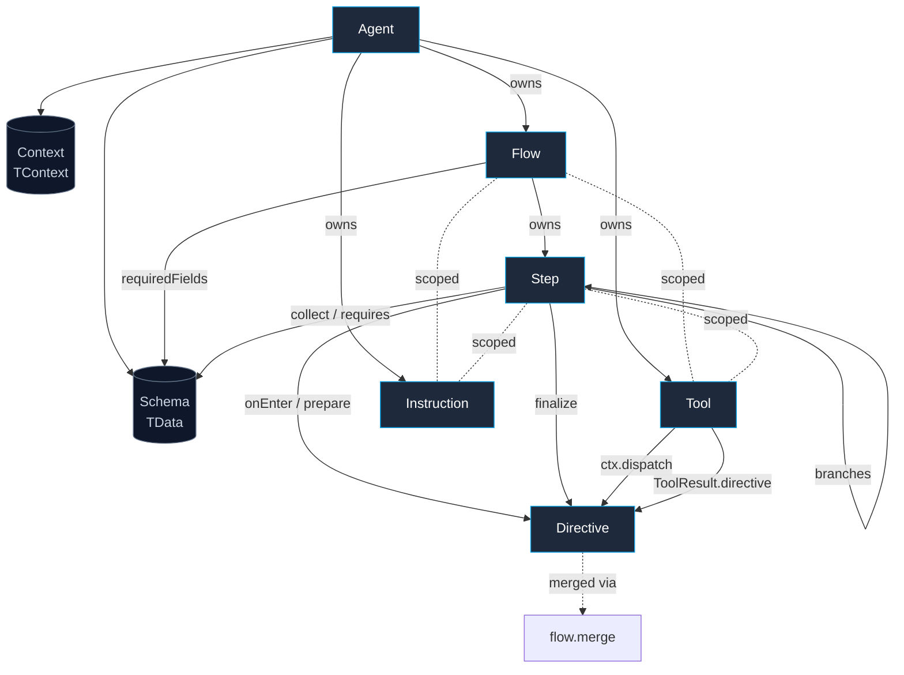

# Architecture

> the AI understands, the code is in control

Six types do all the work. Five are about declaration — what the agent looks like in source. One is about control — what tools and hooks return at runtime to redirect a turn. This page maps the ownership and reference relationships between them, explains the schema-first principle that makes pre-extraction work, and draws the line between what the AI does and what the code does.

LLMs are good at language and unreliable at control flow. They paraphrase well; they do not maintain invariants. They infer intent well; they do not enforce completion gates. The framework's job is to keep the AI on the side of language — understanding intent, extracting structured data, generating prose — while keeping the code on the side of decisions: which flow runs, when a flow completes, what a tool actually does, what state survives a turn.

This page explains the shape of that seam. It names the six primitives, says what each one is for, and shows how they reference each other. It does not teach syntax. Once the mental model is in place, the [reference](../reference/create-agent.md) pages document the contracts and the [tutorial](../start/01-install.md) walks through the code line by line.

## Core vocabulary

Eight terms cover everything below. Every other term in the docs defines itself at first use — there is no separate glossary.

| Term | What it means here |
|------|--------------------|
| **Agent** | The top-level object. Owns the schema, provider, flows, tools, signals, and persistence. |
| **Flow** | A single conversational goal — an ordered sequence of steps with shared completion semantics. |
| **Step** | One node inside a flow. Asks a question, collects fields, calls tools, runs hooks, or speaks a verbatim line. |
| **Tool** | A typed function the AI can call. May redirect the conversation by emitting a directive. |
| **Instruction** | A behavioral statement (`must` / `never` / `should`) that shapes how the agent talks at a given scope. |
| **Directive** | A flat object any tool, hook, or branch returns to write state, change position, or speak verbatim. |
| **Schema** | The single source of truth for `TData` — what the agent collects across the whole conversation. |
| **Context** | Ambient app data of type `TContext` — user, env, services. Independent of `TData`. |

These are the words the rest of the docs use without footnotes. They are also the words the type system uses — every name in the table maps directly to an exported symbol or a generic parameter.

## The six primitives

Six types do all the work. The first five are about declaration — what the agent looks like in source. The last one is about control — what tools and hooks return at runtime to act on a turn. None of them is novel on its own. The shape of the framework is in how few there are and how cleanly they compose.

A small illustrative sketch first, just to show the silhouette:

```typescript
const agent = createAgent({
  name: "BookingBot",
  schema: { /* TData shape */ },
  provider: new GeminiProvider({ apiKey }),
  instructions: [
    { kind: "must", prompt: "Confirm dates before booking." },
  ],
  tools: [
    { id: "book_hotel", handler: async (ctx) => { /* ... */ } },
  ],
  flows: [
    {
      title: "Booking",
      requiredFields: ["city", "checkIn"],
      steps: [
        { id: "ask",     prompt: "Collect city and date.", collect: ["city", "checkIn"] },
        { id: "confirm", prompt: "Confirm and call book_hotel.", requires: ["city", "checkIn"] },
      ],
    },
  ],
});
```

Five of the six primitives appear by name in that block. The remaining one — `Directive` — surfaces only when control flow is on the line, returned from a tool or hook to redirect the conversation.

### Agent

An `Agent<TContext, TData>` is the top-level handle. It binds the four ingredients of a conversational system: a **schema** (what to collect), a **provider** (which LLM to call), a set of **flows** (what goals to pursue), and an optional **persistence** adapter (where to keep sessions). Anything ambient — auth, feature flags, services — rides on `TContext`. Anything collected — names, dates, choices — lives in `TData`. Both type parameters are inferred once at the agent boundary and propagate through every flow, step, tool, and hook beneath it.

The agent owns the registry. It assigns a deterministic id to every flow, step, and tool; it enforces a single `schema` at every `collect` site; it holds the chosen provider and the session lifecycle. It exposes `respond(message)` and `respondStream(message)` for handling user input, plus `dispatch(target, session)` for redirecting from outside a turn. One agent serves many concurrent conversations — a session id keys into the persistence adapter, and `respond` is otherwise stateless from the caller's perspective.

### Flow

A `Flow<TContext, TData>` is one conversational goal — booking a hotel, escalating a complaint, onboarding a teammate. Each flow declares a `title`, a list of `steps`, optional `requiredFields` that gate completion, and conditions for activation: `when` for AI-evaluated strings, `if` for code predicates. The flow router selects exactly one flow per turn, so a flow is also the unit of attention — at any moment, the agent is either inside one flow or sitting idle between flows.

A flow owns its steps in declaration order, its scoped instructions and tools, and its completion semantics. The top-level `onComplete: string` is sugar for chaining into another flow on completion; for dynamic logic, `hooks.onComplete` returns a `Directive`. The optional `reentrant` flag opts the flow into "do another?" loops — on re-entry, the engine clears every field declared in `requiredFields` and `optionalFields` so the flow starts fresh. A flow does not own session data — `TData` lives at the agent — but it does declare which fields it needs to be considered done.

### Step

A `Step<TContext, TData>` is a single node inside a flow. Each step describes one moment in the conversation: ask a question, collect a few schema fields, call a tool, branch to another step, or speak a verbatim line. Steps are the smallest unit the engine can suspend on between user turns — when a step finishes, the engine checks for a directive, then for branches, then falls through to the linear successor. Steps are also the unit at which scoped tools and instructions attach, so a step can shadow an agent-level setting locally without modifying the agent.

A step comes in three mutually exclusive shapes. An **LLM step** has a `prompt` and the engine calls the model. An **auto step** sets `auto: true` — pure computation, no LLM call, only `onEnter`, `prepare`, and `branches` execute. A **reply step** sets `reply` — the engine renders the template and emits it verbatim, skipping the model entirely. Beyond shape, a step owns its `collect` set (which schema fields it extracts), its `requires` list (prerequisites that must be present before entry), its scoped tools and instructions, its `branches` for explicit forks, and the four lifecycle positions: `onEnter`, `prepare`, `finalize`, `onExit`. The combination of three shapes and four lifecycle positions is what lets a step be either a conversational moment or a pure pipeline node, with no third category in between.

### Tool

A `Tool<TContext, TData, TResult>` is a function the AI can call during a turn. Every tool is a single interface — `id` is the sole identifier, every metadata field is optional, and the handler receives a `ToolContext` (a typed view of `data`, `context`, `history`, plus `dispatch` for mid-handler redirection). A tool can return a plain value, a `ToolResult` with state writes, or a `ToolResult` with an embedded `directive` that redirects the conversation when the result is delivered.

A tool owns its parameters schema (what arguments the LLM may pass), its handler (what actually runs), and the optional safety metadata that lets the executor reason about it: `isReadOnly`, `isConcurrencySafe`, `isDestructive`, `validateInput`, `checkPermissions`, `maxResultSizeChars`. Tools are scoped — defined on the agent (always available), on a flow (available only while that flow is active), or on a step (available only while that step is current). Resolution stacks scope-on-scope so a step can shadow an agent-level tool by id without removing it from the registry.

### Instruction

An `Instruction<TContext, TData>` is a single behavioral statement that shapes how the agent talks. Every instruction carries a `kind` discriminator — `must` for absolute do, `never` for absolute don't, `should` for conditional nudge — alongside a `prompt` (the rendered text) and optional activation conditions (`when` for AI strings, `if` for code predicates). One shape covers every behavioral nudge in the system; the only thing that differs from one instruction to the next is its severity and its scope.

An instruction owns its rendered position in the prompt. The composer renders each active instruction as a single bullet under the system prompt's `## Instructions` section, prefixed with its kind and a scope caption: `[Always]` for agent-level, `[In: <FlowTitle>]` for flow-level, `[Step: <stepId>]` for step-level. The set actually rendered on a turn is reported back as `appliedInstructions` on the response — observability is deterministic, derived from rendering, not self-reported by the model.

### Directive

A `Directive<TContext, TData>` is a flat object literal — not a class, not a builder, not a discriminated union — that any tool, hook, or branch returns to act on the turn. Every field is optional. A directive carries up to four orthogonal payloads: at most **one position field** (`goTo`, `goToStep`, `complete`, `abort`, or `reset`), zero or one **verbatim reply**, optional **state writes** (`dataUpdate` / `contextUpdate`), and optional **pre-LLM augmentation** (`appendPrompt`, `injectTools`, `halt`) plus optional `reason` strings inside object forms for traceability. The flatness is intentional — earlier drafts modeled directives as a discriminated union, but a flat object composes more naturally when a single decision point needs to write state, change position, and speak verbatim in one return value.

The directive is the single language the framework speaks for control flow. A tool that decides "this user is ineligible" returns `{ goTo: "denial", reply: "Sorry — you don't qualify." }`. A finalize hook that finishes a booking returns `{ complete: true, dataUpdate: { bookingId } }`. A prepare hook that detects a VIP returns `{ appendPrompt: ["This caller is VIP — confirm preferences first."] }`. All of these merge through one algorithm — position fields by precedence, state writes shallow-merged, `reply` last-wins — implemented as `flow.merge(a, b)` and applied uniformly across the turn pipeline.

The three pre-LLM fields (`appendPrompt`, `injectTools`, `halt`) have a one-turn lifetime: they only take effect in pre-LLM hooks (`onEnter`, `prepare`). When emitted from post-LLM hooks or persisted to `session.pendingDirective`, they are ignored with a WARN log. This keeps one type for all emitters while the engine enforces the phase boundary at runtime.

## Supporting concepts

The six primitives carry the weight. Four supporting pieces make them ergonomic.

### `flow` namespace

`flow` is a small runtime helper namespace exported from the package root. There are no constructor builders here — directives are object literals everywhere they appear in source. The namespace exists for runtime work: validating a directive that arrived from outside the framework (an RPC payload, a queue message), merging two directives by hand when composing custom orchestration, or narrowing an `unknown` value to `Directive` in a type guard.

```typescript
import { flow } from "@falai/agent";

flow.isDirective(x);   // type guard
flow.merge(a, b);      // Algorithm 4 merge of two directives
flow.validate(d);      // throws FlowConfigurationError on invalid shape
```

`flow.merge` is the same algorithm the engine runs internally on the per-turn directive bus, exposed for callers that need to compose results before dispatching them. `flow.validate` enforces three invariants — at most one position field, no empty `goTo: {}`, no `reply` alongside `abort` — and throws a typed error otherwise. The pipeline calls it eagerly on every emitted directive, so downstream code can rely on shape.

### `createAgent`

`createAgent(options)` is the level-1 entry point for constructing an agent. It is sugar over `new Agent(options)` and accepts the same `AgentOptions` shape, but reads more naturally for the common case: one options object, generic inference flowing from `schema` through every `flows[].steps[].collect` reference. The type of `session.data` and tool-handler arguments is derived once at the call site and propagates everywhere.

```typescript
const agent = createAgent({
  name: "BookingBot",
  provider: new GeminiProvider({ apiKey: process.env.GEMINI_API_KEY! }),
  schema: { /* ... */ },
  flows: [/* ... */],
});
```

The factory is the recommended construction path for application code. The class form (`new Agent(options)`) remains for power users who need to subclass — for example, to override `respond` for custom telemetry, or to add bespoke methods on top of the agent surface. Both share validation: misuse surfaces as `FlowConfigurationError` synchronously at construction, before any turn runs.

### `Agent.dispatch`

`agent.dispatch(target, session)` is the imperative entry point for redirecting a session from outside a turn — typically from a webhook, a cron job, or a UI button that jumps the user into a different flow. It accepts either a string shorthand (`"Feedback"` desugars to `{ goTo: "Feedback" }`) or a full `Directive`. Internally, it writes `session.pendingDirective` and persists; the directive is consumed at the start of the next `respond` call before any other resolution runs.

```typescript
const updated = await agent.dispatch(
  { goTo: "Billing", reply: "Transferring you now." },
  session,
);
```

Inside a turn, the same effect is reached by returning or dispatching a directive from a tool or hook — the per-turn bus handles the merge. Outside a turn, `Agent.dispatch` is the sanctioned entry point for setting the next position. There is one way to express each thing, and this is the one for "the user just clicked the cancel button in the UI; their next message should land in the Cancellation flow."

The two routes — in-turn (return a directive) and out-of-turn (`Agent.dispatch`) — converge on the same place: `session.pendingDirective`. The pipeline consumes that field at the very top of the next turn before signals or routing run, applies it via `applyDirective`, and clears it. Persistence sees the same shape regardless of where the directive came from, which means the persisted state is independent of how the redirection was issued.

### Branches

A step's `branches` field declares an explicit, source-local fork: from this step, here are the next-step options and how each one is chosen. Branches sit between code and AI — `if` predicates evaluate for free, `when` strings call the LLM only when the predicate already passed. The first matching entry wins, and its `then` resolves to a step id (within the current flow), a flow id (sugar for `goTo`), or a full directive (for cross-flow steps and state-writing forks).

Branches are the answer to "how do I fork without an LLM call when the choice is purely a function of `data`?" — combined with `auto: true`, an entire decision can run with zero tokens. They coexist with the implicit-fork pattern (multiple successor steps, each carrying its own `step.when`); when both are present on the same step, branches take precedence. Branch resolution sits between the post-LLM phase of the directive bus and the linear successor selection — it is one specific position in the [turn pipeline](./pipeline.md), not a parallel system.

Branches are also the place where the AI/code split is most visible at the call site. A single `branches` array can mix entries: one entry that uses `if` only (free), one that uses `when` only (one LLM call), one that uses both (`if` short-circuits the `when` evaluation). The author chooses per branch, and the cost of that choice is local to one entry rather than buried in a flag elsewhere.

## How the primitives reference each other

The diagram below maps the ownership and reference relationships between the six primitives and the two state surfaces. Solid arrows are ownership. Dashed lines are scoping or extension. The two state nodes (`Schema` and `Context`) are not primitives — they are the typed surfaces the primitives operate on, drawn at the bottom because everything else references them.



Read it top-down. The agent owns flows, tools, and instructions, and binds them to a single schema and a single context type. A flow owns steps and may scope its own instructions and tools. A step references the schema through `collect` and `requires`, may carry its own scoped instructions and tools, and may fork via `branches` into another step. Hooks and tools emit directives — pre-LLM hooks use the pre-LLM fields (`appendPrompt`, `injectTools`, `halt`), post-LLM hooks use position/state/reply fields. The `flow` namespace validates and merges them.

The two state types — `Schema` for `TData`, `Context` for `TContext` — sit at the bottom because everything else points at them. They are not primitives in the same sense as the six types; they are the typed surfaces those primitives operate on, and they are owned by the agent.

Two things are deliberately absent from this diagram. There is no separate "router" primitive — flow selection is an internal pipeline phase, not a user-facing type. There is no separate "session" primitive in the declaration model — sessions are runtime state, indexed by `sessionId`, persisted by adapters, but not something application code constructs as a building block. Both of those concerns live in the [turn pipeline](./pipeline.md), where they are explained as steps in the per-turn sequence rather than parts of the static structure.

## The schema-first principle

`TData` is **agent-level**, not flow-level. One schema describes everything that can be collected across every flow. Flows declare which fields they need (`requiredFields`); steps declare which fields they extract (`collect`) and which they require (`requires`). This is what makes pre-extraction work: when the user message arrives, the engine extracts every collectable field it can in a single pass into `session.data`, then skips any step whose `collect` set is already satisfied.

The agent owns the schema, so the same field can be collected by step A in flow X and used as a prerequisite by step B in flow Y. The contracts at every site are the same shape — `(keyof TData)[]` — and TypeScript verifies them at compile time. Move a field name once at the schema and the failures surface immediately at every call site that references it.

A practical consequence: a single user message like "I want a hotel in Lisbon for two people next Friday" populates `city`, `guests`, and `checkIn` in one extraction pass. The booking flow's first three steps all skip — their `collect` sets are already satisfied — and the engine arrives at the confirmation step on the very first turn. The flow's `requiredFields` gate completion the same way regardless of whether fields were collected one per turn or three at once. The schema does not care which step did the work; it only cares that the data is there.

## What the AI does, what the code does

Two halves divide the work, and the seven primitives are positioned on whichever half makes the decision cheap and correct.

The AI is responsible for **language**: routing scores (which flow does this message want?), pre-extraction (what fields can be lifted out of this message?), step prompts (what should the assistant say to advance this step?), and the `when` half of conditions (does this AI-readable description match the situation?). The model is good at these jobs, and the framework spends tokens on them deliberately.

The code is responsible for **decisions**: completion (are all required fields present?), branches (does the `if` predicate pass?), tool execution (run the function, get a result), directive merging (which position field wins?), persistence (write the session, atomically). The runtime is good at these jobs, and the framework keeps them on the deterministic side of the seam.

A primitive sits on the side that owns its decision. A `Flow.when` is AI because intent classification is the AI's job. A `Step.if` is code because boolean checks against `data` are the code's job. A `Directive` is code because the merge algorithm is deterministic. An `Instruction` is rendered text the code controls; the model only chooses how to follow it. Pulling on either thread leads back to the same answer: language belongs to the AI, decisions belong to the code, and the framework is the seam.

The `when` / `if` split is the smallest visible expression of this principle. The same activation slot — on a flow, on a step, on an instruction, on a branch entry — accepts both: a string for the AI to evaluate, a function for the code to evaluate. When both are set, code runs first and short-circuits the AI call when the predicate already disqualifies the option. There is no unified condition type that abstracts the difference, because the difference is the point. One side spends tokens; the other does not. Authors choose explicitly, every time.

## What stays out

A few things are notably absent from the framework, and the absences are part of the architecture.

There is no built-in router DSL. The flow router is a single internal phase that scores flows by their `when`/`if` activation, applies a margin against the currently active flow to avoid thrashing, and lands on exactly one flow per turn. It is not exposed for subclassing or composition because there is nothing usefully variable about it at the application layer.

There is no per-flow schema. Every flow consumes the agent's `TData`. A flow that needs an extra structured field declares it on the agent schema and lists it in `requiredFields`. The "this flow has its own private state" pattern always becomes "this flow uses a subset of the shared schema."

There is no implicit messaging. The framework never emits a message of its own. Completion is a pure state transition — the active flow ends, the session goes idle, and any prose at that boundary comes from a developer-defined `reply` step or from the next flow's first step. Nothing speaks unless a step or a directive says it.

There is no glossary. Eight terms are defined in the callout at the top of this page, and every other term in the docs defines itself at first use on the page that introduces it. The framework's surface is small enough that a glossary would duplicate prose without adding clarity.

## Why six primitives

The set of six is the result of a few specific cuts. Each one collapsed a category of duplication into a single shape, and each one is worth naming for its own sake — not for migration purposes (the [migration guide](../migration/v1-to-v2.md) covers that), but because the surface visible today is the result of those choices.

**One word per concept.** The verb form `route()` is still the act of selecting a flow, and "routing" is still the gerund — but the noun for "a single conversational goal" is **Flow**. The system that selects one is the **FlowRouter**. There is no overlap between the noun and the verb, which keeps the surface readable when the two appear in the same sentence.

**One Instruction with a kind discriminator.** A behavioral statement is an `Instruction` with `kind: 'must' | 'never' | 'should'`. The three values cover absolute do, absolute don't, and conditional nudge — every behavioral statement an author wants to make falls into one of those categories, and the severity is visible at the call site. The renderer treats all three identically: same prompt position, same scope caption, same `appliedInstructions` reporting. Severity is what the model sees, not what the framework branches on.

**One Tool with optional metadata.** A `Tool` is a single interface. The simple case is `{ id, handler }`. The production case adds `validateInput`, `checkPermissions`, `isReadOnly`, `isConcurrencySafe`, `isDestructive`, and `maxResultSizeChars` — every one optional. There is no upgrade boundary mid-codebase: a tool that starts as a plain function adds metadata fields when it needs them, without changing type or import. The executor reads each field defensively (undefined falls back to safe defaults), so the same tool runs identically with two metadata fields or zero.

The remaining four primitives — Agent, Step, Flow, Directive — were always single-shape concepts. The six-primitive count is what survives those three consolidations plus the three that stood on their own.

## Construction shape

The level-1 entry point is `createAgent({ ... })` — one options object, generic inference flowing from `schema` through every `flows[].steps[].collect` reference. The class form `new Agent({ ... })` accepts the same options for power users who need to subclass.

```typescript
import { createAgent, GeminiProvider } from "@falai/agent";

const agent = createAgent({
  name: "BookingBot",
  provider: new GeminiProvider({ apiKey }),
  schema: { /* TData shape */ },
  flows: [/* FlowOptions[] */],
  tools: [/* Tool[] */],
  instructions: [/* Instruction[] */],
});
```

The construction shape encodes the ownership tree: an agent owns flows, tools, and instructions; the schema is set once; the provider is bound. Generic inference does the rest. The first time a `collect: ["foo"]` references a key not in the schema, the type checker objects at the call site. The first time two flows declare the same id, the constructor throws `FlowConfigurationError` synchronously. The first time a tool returns a malformed directive, `flow.validate` throws at apply time. Every error has a typed class, a single format (`[<ErrorClass>] <what>: <why>. <how to fix>.`), and a place in the construction or runtime sequence where it consistently surfaces.

## What's next

The next page walks through what happens when `agent.respond(message)` is called: the per-turn pipeline, resolution precedence (`pendingDirective` first, then signals + routing in parallel, then auto-step chains, then branches, then linear succession), the directive bus, and how `flow.merge` collapses simultaneous emissions into a single applied directive. After that, the [Directives](./directives.md) page goes deeper into the directive shape itself — why it is flat, how `SignalDirective` extends it for signals, and what each field does.

If the goal right now is to write code, the [tutorial](../start/01-install.md) starts from a one-line install and arrives at a working agent in five short pages. If the goal is to look up an exact contract, every primitive on this page has a [reference](../reference/create-agent.md) page with the full TypeScript declaration, a fields table, two short examples, and the typed errors it can throw.

**Next:** [Turn pipeline](./pipeline.md)
