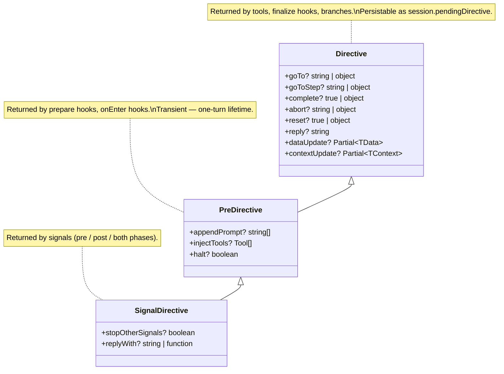

# Directives

> **Where this is introduced:** [Turn pipeline](./pipeline.md)

A directive is the single language `@falai/agent` speaks for control
flow. When a tool decides "this user is ineligible," it returns
`{ goTo: "Denial", reply: "Sorry — you don't qualify." }`. When a
finalize hook closes a booking, it returns
`{ complete: true, dataUpdate: { bookingId } }`. When a pre-phase
signal detects a frustrated user, it dispatches
`{ appendPrompt: ["Lead with empathy."] }`. Different jobs, different
emitters, one shape.

This page explains why the shape is flat, what each field does, how
they merge when more than one handler emits during the same turn, and
how `Directive`, `PreDirective`, and `SignalDirective` form the
inheritance chain that lets pre-LLM hooks and signals add capability
without adding a parallel type system. The page is conceptual — the
[directive reference](../reference/directive.md) carries the
field-by-field contract.

## Why a flat shape

An earlier draft of v2 modeled directives as a discriminated union:
`{ type: 'goto_flow', flow: 'X' }`, `{ type: 'complete', next: ... }`,
`{ type: 'abort', reason: ... }`, and so on. The shape that ships is
flat — a single interface with optional fields, no `type`
discriminator, no builder, no factory functions. Four reasons drove
the decision, and each one is visible at the call site once you know
to look for it.

**Single shape.** Every emitter returns the same object literal. A
finalize hook does not have to choose between `Directive.goto({...})`
and `Directive.complete({...})` and `Directive.reply({...})` — it
returns `{}` with whichever fields it needs. Authors learn one shape
and reach for it from tools, from prepare hooks, from finalize hooks,
from signal handlers, from branch `then` targets. The framework's
control-flow vocabulary is one type wide. The same object literal is
also persistable verbatim as `session.pendingDirective`, so the shape
that sits in source code is the same shape that crosses the
persistence boundary.

**Trivially mergeable.** Algorithm 4 — the per-turn merge that the
pipeline runs over the directive bus — works on a flat object: pick
the winning position field by precedence, last-wins for `reply`,
shallow-merge state writes, concatenate the pre-LLM arrays. A nested
discriminated union would force a per-variant merge case at every
combinator: how do you merge a `goto_flow` with a `complete`? With a
`reply`? With a `dataUpdate`? Every cross-variant combination becomes
its own special case. With a flat object, "merge" is one function
that does not branch on shape.

**Validates statically.** TypeScript narrowing on field presence is
clean. `if (d.goTo) { /* d.goTo is string | object */ }` is the
entire pattern. A discriminated union adds one extra branching level
at every call site — `if (d.type === 'goto_flow') { /* d is the
goto_flow variant */ }` — and the variant types repeat the same
optional-fields prose for state writes and `reply`. The flat shape
moves "is this a position directive or a state directive or a reply"
from a type-level question to a runtime question that the merge
algorithm answers once.

**Composable.** A directive carries up to four orthogonal payloads
without forcing them into a hierarchy: at most one position field,
optional state writes (`dataUpdate` / `contextUpdate`), an optional
verbatim `reply`, and on `PreDirective` an optional set of pre-LLM
augmentations. `dataUpdate` works alongside `goTo`. `reply` works
alongside `complete`. A booking tool's success result writes the
booking id and finishes the flow in one return value:
`{ complete: true, dataUpdate: { bookingId } }`. A bridge utterance
at a flow boundary writes nothing and only speaks: `{ reply: "Let me
transfer you." }`. The same primitive covers both because the fields
do not exclude each other by shape — only by validation.

The trade-off is that exhaustive `case` checking on a `type`
discriminator is gone. The pipeline replaces it with structural
validation (`flow.validate`) — one position field at most, no empty
`goTo: {}`, no `reply` alongside `abort` — that runs at apply time
anyway, since flow and step lookups are runtime checks regardless. The
exchange is one less compile-time check for a far cleaner authoring
surface and a merge algorithm that does not branch on shape.

## Position fields and their precedence

A directive carries at most one **position field**. Position fields
answer the question "where does the conversation go next?" The five
options span every form of position control the framework offers:

| Field | What it means |
|-------|---------------|
| `goTo` | Jump to another flow. |
| `goToStep` | Jump to a step (within the current flow, or — in the object form — within another flow). |
| `complete` | Mark the current flow done. The flow's completion logic runs. |
| `abort` | End the conversation. Optionally clear the session. |
| `reset` | Restart the current flow. Optionally clear its declared fields. |

Each of `goTo`, `goToStep`, `complete`, `abort`, and `reset` accepts
both a shorthand and an object form. The shorthand expresses the
common case (`goTo: "Booking"`, `complete: true`, `abort: "denied"`).
The object form exposes the optional knobs — `reason` strings for
observability, `data` for pre-entry state writes, `clearSession` /
`clearData` flags for the destructive variants. The fields are
mutually exclusive: setting two at once throws
`FlowConfigurationError` at validation. There is no "go to *and*
abort" — only one position can win per directive.

When more than one emitter writes a position field during the same
turn — a tool returns `goTo` and a finalize hook returns `complete` —
the merge algorithm picks one winner by precedence:

```
abort > complete > goTo / goToStep > reset
```

The order encodes intent. **`abort` always wins.** A handler that
ended the conversation cannot be overridden by a later "go somewhere
else" — there is no somewhere else. **`complete` beats `goTo` and
`goToStep`.** The flow is ending; any follow-up jump belongs in
`complete.next` (which chains another directive after completion),
not as a competing position field. **`goTo` and `goToStep` share a
tier.** Both express "next position is here" — the difference is
flow-level vs step-level granularity, and within the tier last
emission wins. **`reset` is lowest.** Any explicit jump out of the
current flow beats a "restart this flow" emitted earlier in the
phase.

Within the same tier, the most recent emission wins, with a debug
log naming all losers so a noisy turn is diagnosable from the trace.
The precedence ordering does not change between phases: it applies to
the pre-LLM bus, the post-LLM bus, and the signal phases identically.

## State writes

Two fields — `dataUpdate` and `contextUpdate` — write to session
state. Both are `Partial<>` slices of their respective surfaces:
`dataUpdate?: Partial<TData>` writes into `session.data`,
`contextUpdate?: Partial<TContext>` writes into `session.context`.
Both fire their respective hooks (`flow.hooks.onDataUpdate`,
`flow.hooks.onContextUpdate`) after the merge applies, and both run
through schema validation atomically — every field across every
emitter on this turn is checked together, and the session is not
mutated unless the whole set passes.

State writes are **additive** and shallow-merged across emitters in
emission order. If a flow-level `onEnter` writes
`{ dataUpdate: { tier: "vip" } }` and a step-level `prepare` writes
`{ dataUpdate: { lastSeen: now } }`, the merged result is
`{ tier: "vip", lastSeen: now }` — neither hook needs to know about
the other. On key collision, last write wins. The merge is shallow —
top-level keys are replaced wholesale, nested objects are not
deep-merged. To update a nested object, read it from `data`, merge
in code, write back the full sub-object. Deep merge is intentionally
absent because it would silently disagree with TypeScript's
`Partial<>` shape: the type says "I'm overwriting this key," and the
runtime should agree.

State writes always apply, regardless of what the position fields do.
A directive with `{ goTo: "Denial", dataUpdate: { reason: "expired" }
}` jumps flows *and* writes the reason. A directive with only
`{ dataUpdate: {...} }` writes state and stays where it is. Position
fields and state writes are orthogonal payloads; they don't compete
for the same slot.

## Reply as a verbatim utterance

The `reply: string` field is the framework's way of letting code
speak. When a directive sets `reply`, the LLM call for the entered
step is skipped this turn and the literal string becomes the
assistant's message. The text is taken verbatim — no templating, no
post-processing, no "the model rephrased it" surprise.

`reply` is the right tool for utterances that should be exact:
confirmations ("Booking confirmed."), bridges ("Connecting you with a
specialist now."), refusals ("Sorry — you don't qualify."), and
boilerplate at flow boundaries. It is the wrong tool for anything
that should adapt to context — that's what the model is for. The two
shapes coexist on the same step boundary: `reply` for the line, the
LLM for the conversation.

`reply` co-validates with two other fields. With **`abort`**, it is
rejected at validation — an aborted conversation cannot deliver a
reply. With **`halt: true`** (a `PreDirective` field, see below), it
is the assistant message and the turn ends with
`stoppedReason: 'reply'`; if `halt` is set without `reply`, the turn
ends with `stoppedReason: 'halt'` and an empty body. Across multiple
emitters in the same turn, `reply` is **last-wins** — the most
recent emission overrides earlier ones, with a debug log so the
override is visible in the trace.

`reply` is the same shape on `Directive` and on `PreDirective` —
there is no separate "speak before the LLM" vs "speak after the
LLM" type. The phase the directive runs in determines whether the
reply replaces a message that would have been generated (pre-LLM) or
replaces one that just was (post-LLM). The field stays the same.

## PreDirective fields

`PreDirective` is the `Directive` variant that pre-LLM hooks return.
It inherits every base field — position writes, state writes,
`reply` — and adds three more that only make sense before this turn's
LLM call: `appendPrompt`, `injectTools`, and `halt`.

**`appendPrompt: string[]`** is the prompt nudge slot. Each string is
a sentence the prompt composer appends to the system prompt for this
turn only. A flow-level `onEnter` that detects a VIP caller can add
"This caller is a VIP — confirm preferences before suggesting
options." A step-level `prepare` that detects a returning customer
can add "The user is a returning customer; skip introductions." Both
fire on the same turn, and both sentences land in the prompt's
per-turn appendage slot in emission order. The slot is never cached
(the prompt section cache memoizes static sections only) and never
persisted — `appendPrompt` lives for one turn and is gone.

**`injectTools: Tool[]`** is the per-turn tool slot. Tools listed
here are added to the available tool list for this turn only,
stacked on top of the agent → flow → step → transient resolution
chain. A `prepare` hook that detects an ambiguous request can inject
a `lookup_account` tool for a single LLM call without registering it
on the step or the flow. The slot is never persisted — tool
references are functions, and functions are not JSON-serializable —
so the field is structurally one-turn-only.

**`halt: boolean`** is the kill switch. When any pre-phase emitter
sets `halt: true`, the LLM call is skipped entirely. If `reply` is
also set, the verbatim string becomes the assistant message. If not,
the turn ends with `stoppedReason: 'halt'` and an empty body. `halt`
merges by **logical-OR** — a single emitter setting it is enough to
halt the turn. The field is the framework's circuit breaker: a hook
that detects an unresolvable state can stop the turn outright
without competing with other emitters.

The three `PreDirective`-only fields are stripped from
`session.pendingDirective` before persistence — `pendingDirective`
holds a plain `Directive`, and the augmentation fields cannot survive
across turns by design. If a post-LLM hook returns a `PreDirective`
with these fields set, they are dropped with a debug warning: an
`appendPrompt` after the fact has no prompt to append to, an
`injectTools` after the fact has no LLM call to inject into, and a
`halt` after the fact has no LLM call to halt. The remaining base
`Directive` portion is honored.

`appendPrompt` is concatenated across emitters in emission order
without deduplication — duplicate sentences from different sources
are preserved (a flow-level "be polite" plus a step-level "be polite"
is acceptable redundancy). `injectTools` is concatenated and then
deduped by `Tool.id`, with the later definition winning — typically a
step-level injection overriding a flow-level default. `halt` is
logical-OR. The merge rules for the inherited base fields stay
identical: position fields by precedence, `reply` last-wins, state
writes shallow-merged.

## The inheritance chain

`Directive` is the base. `PreDirective` extends it with the three
pre-LLM-only fields. `SignalDirective` extends `PreDirective` further
with two signal-specific fields. The chain is one direction —
capabilities accumulate as you go down — and each level is the return
type of a specific class of emitter:



`Directive` is what tools (return value or `ctx.dispatch`), `finalize`
hooks, `flow.hooks.onComplete`, and branch `then` targets return. It
is plain JSON-serializable data — the same shape that sits on the
session as `pendingDirective` and crosses the persistence boundary.

`PreDirective` is what `flow.hooks.onEnter`, `step.hooks.onEnter`,
and `step.hooks.prepare` return. The three augmentation fields and a
live `Tool[]` reference make it non-serializable; the type system
encodes the one-turn lifetime by being a structurally separate type
that the engine strips before persistence.

`SignalDirective` is what signal handlers return — pre-phase
handlers, post-phase handlers, and `both`-phase handlers all use the
same type. The two added fields are signal-pipeline-specific:
`stopOtherSignals` skips remaining handlers in the same phase (it is
consumed inside the signal pipeline, not the directive bus), and
`replyWith` is a late-binding `reply` that accepts a function form
evaluated at emit time. Phase semantics still apply: when a
`SignalDirective` runs in the post-phase, the inherited `appendPrompt`
/ `injectTools` / `halt` fields are dropped (they have no meaning
after the LLM call) and inherited position fields set
`pendingDirective` for the *next* turn rather than redirecting this
one.

The three types share one merge algorithm and one validation pass.
A pre-phase signal can dispatch a `SignalDirective`, a `prepare` hook
can return a `PreDirective`, and the engine merges them through the
same `flow.merge` that handles tool directives — the inheritance
chain exists to widen the type at the call site without splitting the
runtime.

## The `flow` namespace

There are no constructor builders for directives. Directives are
plain object literals — that is the whole point of the flat shape.
What the framework does export is a small runtime helper namespace
for working with directives in code: validating shapes that arrived
from outside the framework, merging two directives by hand, and
narrowing `unknown` values in type guards.

```typescript
import { flow } from "@falai/agent";

flow.isDirective(x);   // structural type guard
flow.merge(a, b);      // Algorithm 4 merge of two directives
flow.validate(d);      // throws FlowConfigurationError on invalid shape
```

`flow.isDirective(x)` is a structural type guard. It returns `true`
for any non-null, non-array object — primitives, `null`, `undefined`,
arrays, and functions are filtered out. Use it to narrow an `unknown`
value coming off an RPC payload or a queue message before passing it
to `applyDirective` or `agent.dispatch`.

`flow.merge(a, b)` is the same Algorithm 4 the engine runs internally
on the per-turn directive bus, exposed for callers that need to
compose results before dispatching them. Position fields merge by
precedence (`abort > complete > goTo / goToStep > reset`, last-wins
within the same tier), `reply` is last-wins, `dataUpdate` and
`contextUpdate` shallow-merge in emission order, `appendPrompt`
concatenates without deduplication, `injectTools` concatenates and
then dedupes by `Tool.id` (later definition wins), and `halt` is
logical-OR. The function is generic in the shared subtype: merging
two `PreDirective`s yields a `PreDirective`, merging two plain
`Directive`s yields a `Directive`.

`flow.validate(d)` enforces three structural invariants and throws
`FlowConfigurationError` when any fails: at most one position field
per directive, no empty `goTo: {}` (the object form requires a flow
id), no `reply` alongside `abort`. The pipeline calls it eagerly on
every emitted directive, so downstream code can rely on shape. It
does **not** validate that referenced flows or steps exist — that
check happens at apply time, against the agent's flow registry, which
the validator does not have a handle on.

The namespace's design intent is "runtime helpers, not authoring
sugar." If you're constructing a directive in source, write the
object literal. If you're handling a directive that came from
elsewhere, narrow it with `flow.isDirective`, validate it with
`flow.validate`, and merge it with `flow.merge`. The seam between
"control flow as code" and "control flow as data" is exactly that
small.

## Where to go next

The directive's mental model is in this page; the field-by-field
contract — every position field's shorthand and object form, every
state-write rule, every typed error the validator can throw — is in
the [Directive reference](../reference/directive.md). The pre-LLM
extras have their own [PreDirective reference](../reference/pre-directive.md).
The signal-specific additions live in [Signals](../reference/signals.md).

When the goal is to *use* directives in handlers, the
[Flow control guide](../guides/flow-control.md) walks through the
recipes: redirecting from a tool, completing a flow with a chained
follow-up, aborting on a permission failure, replying verbatim from a
finalize hook, dispatching a directive from outside a turn. When the
goal is to *understand* where directives sit in the per-turn
sequence, [Turn pipeline](./pipeline.md) covers the bus, the merge
phases, and the resolution precedence around the directive surface.

**Next:** [createAgent reference](../reference/create-agent.md)
