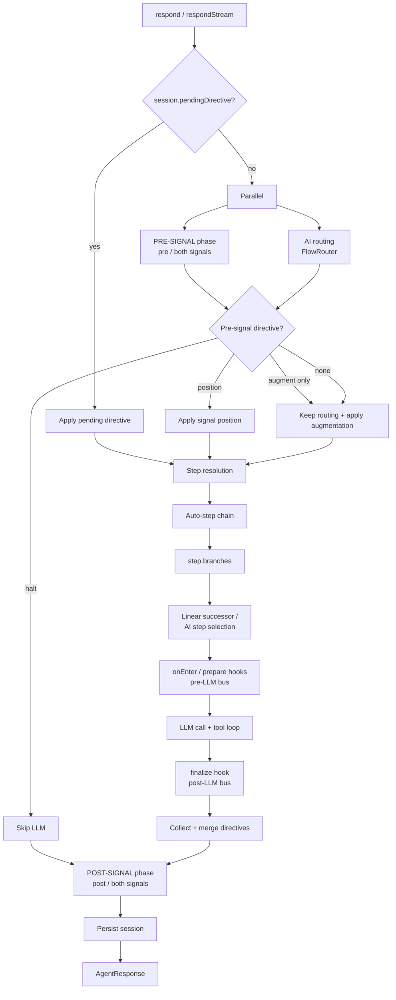
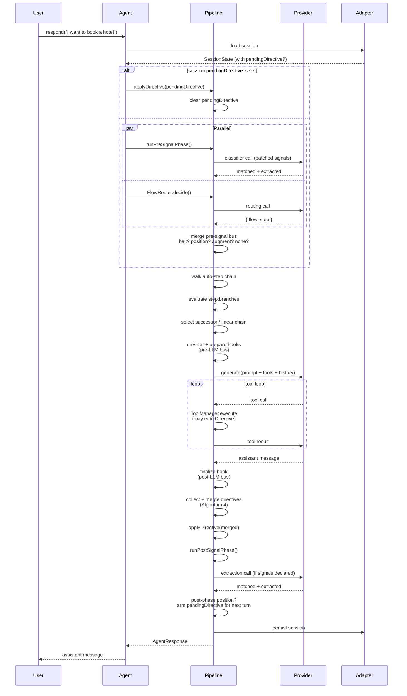

# Turn pipeline

> **Where this is introduced:** [Architecture](./architecture.md)

Every interaction with `@falai/agent` is a *turn* — one user message in,
one assistant message out. Inside that boundary the framework runs a
fixed sequence of phases: it consumes a pending directive, evaluates
pre-signals in parallel with routing, picks the next step, runs hooks
around an LLM call, applies the merged result, and persists. The order
is the same on every turn. The shape of the turn is the framework. The
LLM understands; the pipeline keeps the code in control.

This page is the per-turn mental model: the diagram, the resolution
precedence, the per-turn **directive bus**, and the merge rules used
when more than one handler tries to write at once.

## The pipeline diagram



Three things to notice:

- **`pendingDirective` shortcuts the top half.** When a previous turn
  left a directive on the session, or `agent.dispatch()` was called
  between turns, it is applied first and routing is skipped.
- **Pre-signals run in parallel with routing.** Both calls are issued
  via `Promise.all` so the common case (no halt, no signal redirect)
  pays no extra latency. If a pre-signal halts or sets a position
  field, the parallel routing result is discarded.
- **Post-signals come after the LLM.** They cannot stop *this* turn —
  they observe the assistant's reply, optionally extract structured
  data, and at most arm `pendingDirective` for the next turn.

The two signal phases are no-ops when `agent.signals` is empty or
unset. See [Signals](../reference/signals.md) for the full surface.

## Resolution precedence

When more than one source could decide where the conversation goes
next — a pending directive, a pre-signal, the AI router, an auto-step,
a `step.branches` entry, the linear chain, the post-signal phase — the
pipeline resolves them in a fixed, locked order. This order does not
change between releases. Knowing it is enough to predict what every
turn will do.

1. **`session.pendingDirective` is consumed first.**
   Set on the previous turn (e.g. by a post-signal, by a
   `complete: { next }` chain, by a tool that emitted `goTo`) or by
   `agent.dispatch()` from outside any turn. When present it is
   applied verbatim and the rest of the top half is skipped. The
   field is cleared as part of the apply step so it cannot fire
   twice.

2. **PRE-SIGNAL phase, in parallel with routing.**
   Pre-phase signals (`phase: 'pre'` or `phase: 'both'`) run via the
   same `Promise.all` that issues the routing classifier call. Their
   directives merge through the per-turn bus (see below). If the
   merged pre-phase directive sets `halt: true`, the LLM is skipped
   for this turn. If it carries a position field (`goTo`,
   `goToStep`, `complete`, `abort`, `reset`), that position wins and
   the routing result is discarded. If it only carries augmentation
   (`appendPrompt`, `injectTools`) or state writes (`dataUpdate`,
   `contextUpdate`), routing is kept and the augmentation is layered
   on top.

3. **AI routing.**
   `FlowRouter.decide` picks the active flow and entry step based on
   the user message, conversation history, and each flow's `when`
   condition. Used only when steps 1 and 2 produced no position
   field. Routing is the framework's *intent classifier*: it answers
   "what is the user trying to do right now?" and nothing else. It
   never writes data and never speaks.

4. **Auto-step chain.**
   With a current flow and step in hand, the pipeline walks the
   `auto: true` chain — each auto-step's `onEnter` and `prepare`
   hooks fire, branches resolve, and the chain advances without an
   LLM call until it reaches a non-auto step, a `halt`, a `reply`,
   a `complete`, or the per-turn cap (`maxAutoStepsPerTurn`). Auto
   steps are how the code half of the contract advances state in
   bulk between user messages.

5. **Step branches.**
   When the resolved step has `branches`, they evaluate in
   declaration order. The `if` predicate runs first (free, code-only
   evaluation). If it passes, the optional `when` string is sent to
   the AI as a yes/no classifier. The first entry whose conditions
   all match wins; its `then` is applied — a step id (jump within
   the flow), a flow id (cross-flow jump), or a full `Directive`.
   Code-only branches incur zero token cost.

6. **Linear successor / AI step selection.**
   When no branch matched, the pipeline falls through to the linear
   chain. If exactly one candidate successor passes its `skip`
   condition, that step is entered. If several pass, the framework
   asks the AI to pick (the same routing primitive, scoped to the
   surviving candidates). If none pass, the flow is implicitly
   complete (the *last step terminates the flow* rule from v2 — no
   sentinel value, no special return type).

7. **POST-SIGNAL phase.**
   After `finalize` and the post-LLM bus merge, post-phase signals
   evaluate sequentially against the just-completed turn. They see
   the assistant's reply, the collected data, and any tool results.
   Post-phase position directives (`goTo`, `goToStep`, `complete`)
   set `session.pendingDirective` for the *next* turn — there is no
   mid-turn re-entry, by design, to keep turn semantics legible.
   Pre-LLM-only fields (`appendPrompt`, `injectTools`, `halt`) are
   dropped with a debug warning if a post-phase signal emits them.

This is the precedence the rest of the framework is built around. The
[Resolution precedence section](../reference/signals.md#resolution-precedence-within-a-turn)
on the signals reference page restates the same list as a contract;
this concept page is the prose explanation.

## The directive bus

Hooks, tools, and signal handlers all express their intent the same
way: by emitting a [`Directive`](../reference/directive.md). The
pipeline collects these emissions into a per-turn, in-memory **bus**
and reduces them to a single applied directive at the end of each
phase. Two phases, one merge function.

### Pre-LLM phase

Sources, in fixed order:

1. `agent.hooks.onEnter` (if the agent supports hooks at this level)
2. `flow.hooks.onEnter` for the active flow
3. `step.hooks.onEnter` for the resolved step
4. `step.hooks.prepare`
5. Any `ctx.dispatch` calls made inside the above hooks

These return `Directive` — with the pre-LLM fields
three pre-LLM-only fields (`appendPrompt`, `injectTools`, `halt`). The
merged result feeds the prompt composer and tool manager before the
LLM call:

- `halt: true` skips the LLM entirely (a `reply`, if any, becomes the
  literal assistant message).
- `appendPrompt[]` is concatenated into the system prompt for this
  turn only.
- `injectTools[]` is added to the available tool list for this turn
  only.
- Position fields, state writes, and `reply` carry forward exactly
  as they would from any directive.

### Post-LLM phase

Sources, in fixed order:

1. Each `ToolResult.directive` returned during the tool loop
2. Any `ctx.dispatch` calls inside tool handlers
3. `step.hooks.finalize`
4. `flow.hooks.onComplete` (when the flow finished this turn)
5. The `then` branch of any matched `step.branches` entry whose `then`
   was a full `Directive` (not just a step id)

These return `Directive`. Pre-LLM-only fields here are
dropped with a debug warning — `halt` after the fact has no meaning,
and `appendPrompt` / `injectTools` could not influence a call that
has already happened.

### Why a bus

Two reasons. First, multiple emitters are normal: a `prepare` hook
might add a sentence to the prompt while a tool result writes
collected data while a `finalize` hook completes the flow. The bus
makes "who wrote what" explicit and the merge rules deterministic.
Second, observability: `AgentResponse.directiveChain` returns the full
list of emitted directives in order with their sources, so traces
explain themselves without bisecting hook code.

The bus is purely in-memory and lasts one turn. Nothing about the bus
itself is persisted; only the *applied* directive's effects (state
writes, position changes, `pendingDirective` for the next turn) cross
the persistence boundary.

## Algorithm 4 — merge rules

When the bus has more than one directive in a phase, the pipeline
folds them into a single `Directive` (with pre-LLM fields honored in the pre-LLM
phase) using the following rules. Same rules in both phases; the
pre-LLM phase additionally folds the three augmentation fields.

### Position fields — winner-takes-all by precedence

Exactly one position field can apply per phase. The winner is chosen
by the precedence:

```
abort > complete > goTo / goToStep > reset
```

- **`abort` always wins.** A handler that aborts the conversation
  cannot be overridden by a later "go somewhere else" — there is no
  somewhere else.
- **`complete` beats `goTo` / `goToStep`.** The flow is ending; any
  follow-up jump belongs in `complete.next`, not as a competing
  position field.
- **`goTo` and `goToStep` share a tier.** `goTo` is the cross-flow
  hop; `goToStep` is the within-flow hop. Both express "next position
  is here." Among same-tier emissions, last-wins.
- **`reset` is lowest.** Any explicit jump out of the current flow
  beats a "restart this flow" emitted earlier in the phase.

Within the same precedence tier, **last emission wins**. The pipeline
logs a debug-level warning naming all conflicting sources so a noisy
turn is diagnosable.

### `reply` — last-wins

`reply` is a verbatim assistant utterance — the LLM is bypassed for
the message body. If two emitters set `reply`, the second wins. The
pipeline logs a debug warning so the override is visible.

`reply` and `abort` are mutually exclusive at apply time: an aborted
conversation cannot deliver a reply, and the pipeline rejects the
combination as a `FlowConfigurationError`.

### `dataUpdate` and `contextUpdate` — shallow-merge in emit order

State writes are *additive*: every emitter contributes its slice and
the merger shallow-merges them in declaration order, last write wins
on key collision. The `Object.assign({}, a, b)` semantics — top-level
keys overwrite, nested objects are not deep-merged.

This is the rule that lets a flow-level `onEnter` set a default while
a step-level `prepare` overrides one field on top, without the two
hooks needing to know about each other.

After merging, the combined `dataUpdate` is validated against
`agent.schema` *atomically* — every field across every emitter is
checked together, and the session is not mutated unless the whole set
passes. A failure throws `DataValidationError` with the offending
field and emitter listed.

### `appendPrompt` and `injectTools` — concatenate, then dedupe

Pre-LLM only. Both fields are arrays; the merger concatenates them in
emit order and then deduplicates:

- **`appendPrompt`** is concatenated and rendered into the prompt's
  per-turn appendage slot. No deduplication — duplicates from
  different sources are preserved (a flow-level "be polite" plus a
  step-level "be polite" is acceptable redundancy).
- **`injectTools`** is concatenated and deduped by `Tool.id`. When
  two emitters inject a tool with the same id, the *later* definition
  wins — typically a step-level injection overriding a flow-level
  default.

Both arrays apply only for this turn; they are stripped before
`session.pendingDirective` is written, and they cannot be persisted.

### `halt` — logical-OR

Pre-LLM only. If *any* pre-phase emitter set `halt: true`, the merged
directive halts. There is no "vote" — a single emitter is enough. The
LLM is not called; if a `reply` is also set, that becomes the literal
assistant message; otherwise the turn ends with an empty body and
`stoppedReason: 'halt'`.

`halt` is the framework's circuit breaker: a hook that detects an
unresolvable state can stop the turn outright without competing with
other emitters.

## One turn end-to-end

The same shape, traced as a sequence. Lanes are *User*, *Agent*
(`agent.respond`), *Pipeline* (the internal turn pipeline),
*Provider* (the AI), and *Adapter* (the persistence layer).



A few things this diagram makes precise that the high-level graph
elides:

- The session is loaded *before* the pending-directive check, because
  `pendingDirective` lives on the session itself.
- The pre-signal classifier call and the routing call are issued in
  parallel; the merge step decides whether the routing result is used
  or discarded.
- The tool loop is internal to the LLM phase. Tools that emit
  directives feed the *post-LLM* bus, not the pre-LLM one — they ran
  during a call, not before it.
- The post-signal phase happens *after* directive apply, before
  persistence. That's the only window in which post-phase handlers
  can see the fully-applied turn state.
- Persistence is the last write. Anything that did not survive the
  applied directive (the bus contents, the pre-LLM augmentation
  arrays, `halt`) is gone by the time the adapter is called.

## Where to go next

The pipeline is the *what happens*. The directive is the *how
handlers ask for things to happen*. The next concept page covers the
flat shape, the position field rules, the inheritance chain
`Directive → SignalDirective`, and the `flow`
namespace helpers (`flow.isDirective`, `flow.merge`, `flow.validate`)
that make the bus introspectable from user code.

**Next:** [Directives](./directives.md)
