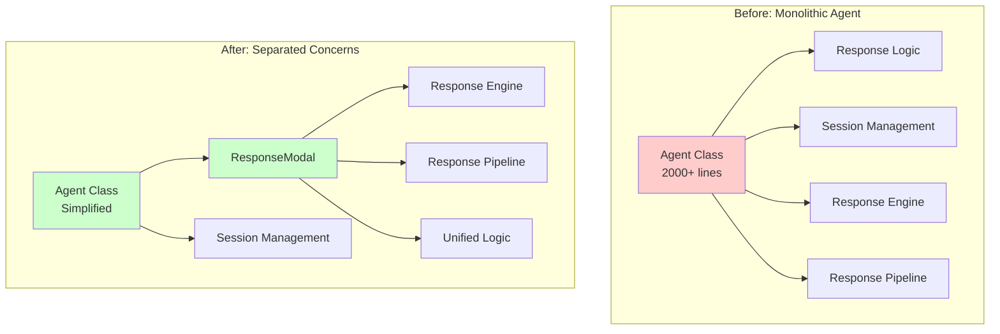

# ResponseModal Refactor Migration Guide

This guide helps you migrate from the legacy response APIs to the new ResponseModal architecture introduced in the latest version. The refactor provides better architecture, modern streaming APIs, and improved maintainability while maintaining full backward compatibility.

## 📋 Table of Contents

- [Overview](#overview)
- [What Changed](#what-changed)
- [Backward Compatibility](#backward-compatibility)
- [New Modern APIs](#new-modern-apis)
- [Migration Strategies](#migration-strategies)
- [Side-by-Side Comparisons](#side-by-side-comparisons)
- [Benefits of Migration](#benefits-of-migration)
- [Troubleshooting](#troubleshooting)

## Overview

The ResponseModal refactor centralizes all response generation logic into a dedicated `ResponseModal` class, providing:

- **🏗️ Better Architecture**: Separation of concerns between Agent configuration and response generation
- **🚀 Modern APIs**: Simple `stream()` and `generate()` methods with automatic session management
- **🔄 Backward Compatibility**: All existing `respond()` and `respondStream()` methods work unchanged
- **⚡ Performance**: Unified response logic eliminates code duplication
- **🛠️ Maintainability**: Centralized response logic is easier to test and maintain

## What Changed

### Internal Architecture



### New Classes

- **`ResponseModal<TContext, TData>`**: Handles all response generation logic
- **`ResponseGenerationError`**: Specialized error handling for response failures
- **New interfaces**: `StreamOptions`, `GenerateOptions`, `ResponseModalOptions`

### New Methods

- **`agent.stream(message, options?)`**: Modern streaming API with automatic session management
- **`responseModal.generate(message, options?)`**: Modern non-streaming API (internal)

## Backward Compatibility

**✅ All existing code continues to work without changes.**

```typescript
// These methods work exactly the same as before
const response = await agent.respond({ history, session });
const stream = agent.respondStream({ history, session });
const chatResponse = await agent.chat("Hello");
```

The only difference is that these methods now delegate to the internal `ResponseModal` class for better architecture.

## New Modern APIs

### Modern Streaming: `agent.stream()`

The new `stream()` method provides a much simpler interface for streaming responses:

```typescript
// NEW: Modern streaming API
for await (const chunk of agent.stream("Hello, how are you?")) {
  if (chunk.delta) {
    process.stdout.write(chunk.delta);
  }
  
  if (chunk.done) {
    console.log("Stream complete!");
    // Session history is automatically updated
  }
}
```

**Key Features:**
- 🎯 Simple interface: just pass the message
- 🔄 Automatic session management
- 🌊 Same streaming performance as `respondStream()`
- 🛑 Supports AbortSignal for cancellation
- ⚙️ Optional context override

### Options Support

```typescript
// With options
for await (const chunk of agent.stream("Explain quantum computing", {
  contextOverride: { userId: "123" },
  signal: abortController.signal
})) {
  // Handle chunk
}
```

## Migration Strategies

### Strategy 1: Gradual Migration (Recommended)

Migrate to modern APIs gradually while keeping existing code working:

```typescript
// Phase 1: Keep existing code working
const response = await agent.respond({ history, session }); // ✅ Still works

// Phase 2: Start using modern APIs for new features
for await (const chunk of agent.stream("New feature message")) {
  // Handle streaming
}

// Phase 3: Gradually replace old APIs when convenient
// Old: agent.respondStream({ history: agent.session.getHistory() })
// New: agent.stream("message")
```

### Strategy 2: Full Migration

Replace all streaming calls with the modern API:

```typescript
// Before: Manual session management
await agent.session.addMessage("user", userMessage);
for await (const chunk of agent.respondStream({ 
  history: agent.session.getHistory() 
})) {
  // Handle chunk
  if (chunk.done) {
    await agent.session.addMessage("assistant", chunk.accumulated);
  }
}

// After: Automatic session management
for await (const chunk of agent.stream(userMessage)) {
  // Handle chunk - session is automatically managed
}
```

### Strategy 3: Hybrid Approach

Use modern APIs for new code, keep legacy APIs for complex existing implementations:

```typescript
// Complex existing code - keep using respondStream()
const complexResponse = await agent.respondStream({
  history: customHistory,
  session: customSession,
  contextOverride: complexContext,
  signal: customSignal
});

// Simple new code - use modern stream()
for await (const chunk of agent.stream("Simple question")) {
  // Handle chunk
}
```

## Side-by-Side Comparisons

### Basic Streaming

```typescript
// ❌ OLD WAY: respondStream() - Manual session management
await agent.session.addMessage("user", "What is TypeScript?");
let fullMessage = "";

for await (const chunk of agent.respondStream({ 
  history: agent.session.getHistory() 
})) {
  if (chunk.delta) {
    process.stdout.write(chunk.delta);
    fullMessage += chunk.delta;
  }
  
  if (chunk.done) {
    await agent.session.addMessage("assistant", fullMessage);
  }
}

// ✅ NEW WAY: stream() - Automatic session management
for await (const chunk of agent.stream("What is TypeScript?")) {
  if (chunk.delta) {
    process.stdout.write(chunk.delta);
  }
  // Session is automatically updated when done
}
```

### Multi-turn Conversations

```typescript
// ❌ OLD WAY: Manual history management
const messages = ["Hello", "How are you?", "Tell me about AI"];

for (const message of messages) {
  await agent.session.addMessage("user", message);
  
  let response = "";
  for await (const chunk of agent.respondStream({ 
    history: agent.session.getHistory() 
  })) {
    if (chunk.delta) response += chunk.delta;
    if (chunk.done) {
      await agent.session.addMessage("assistant", response);
    }
  }
}

// ✅ NEW WAY: Automatic session management
const messages = ["Hello", "How are you?", "Tell me about AI"];

for (const message of messages) {
  for await (const chunk of agent.stream(message)) {
    if (chunk.delta) process.stdout.write(chunk.delta);
    // Session automatically updated
  }
}
```

### With Abort Signals

```typescript
// ❌ OLD WAY: Complex parameter structure
const abortController = new AbortController();
await agent.session.addMessage("user", "Long story please");

for await (const chunk of agent.respondStream({
  history: agent.session.getHistory(),
  signal: abortController.signal
})) {
  // Handle chunk
}

// ✅ NEW WAY: Simple options structure
const abortController = new AbortController();

for await (const chunk of agent.stream("Long story please", {
  signal: abortController.signal
})) {
  // Handle chunk
}
```

### Context Override

```typescript
// ❌ OLD WAY: Complex parameter passing
for await (const chunk of agent.respondStream({
  history: agent.session.getHistory(),
  contextOverride: { userId: "123" }
})) {
  // Handle chunk
}

// ✅ NEW WAY: Clean options structure
for await (const chunk of agent.stream("Hello", {
  contextOverride: { userId: "123" }
})) {
  // Handle chunk
}
```

## Benefits of Migration

### 1. Simplified Code

**Before:**
```typescript
// 6 lines of manual session management
await agent.session.addMessage("user", userMessage);
let fullResponse = "";
for await (const chunk of agent.respondStream({ history: agent.session.getHistory() })) {
  if (chunk.delta) fullResponse += chunk.delta;
  if (chunk.done) await agent.session.addMessage("assistant", fullResponse);
}
```

**After:**
```typescript
// 3 lines with automatic session management
for await (const chunk of agent.stream(userMessage)) {
  if (chunk.delta) process.stdout.write(chunk.delta);
}
```

### 2. Reduced Errors

Common mistakes eliminated:
- ❌ Forgetting to add user message to session
- ❌ Forgetting to add assistant response to session
- ❌ Incorrect history management
- ❌ Session state inconsistencies

### 3. Better Performance

- Unified response logic eliminates code duplication
- Optimized session management
- Reduced memory allocations

### 4. Improved Maintainability

- Centralized response logic in `ResponseModal`
- Better error handling with `ResponseGenerationError`
- Cleaner separation of concerns

## Troubleshooting

### Common Migration Issues

#### Issue: "My existing code stopped working"

**Solution:** This shouldn't happen! All existing APIs are fully backward compatible. If you're experiencing issues:

```typescript
// These should all still work exactly as before
const response = await agent.respond({ history, session });
const stream = agent.respondStream({ history, session });
const chat = await agent.chat("Hello");
```

#### Issue: "Session history is not being updated with stream()"

**Solution:** The modern `stream()` API automatically manages session history. You don't need to manually call `addMessage()`:

```typescript
// ❌ Don't do this with stream()
await agent.session.addMessage("user", "Hello");
for await (const chunk of agent.stream("Hello")) {
  // This will duplicate the message!
}

// ✅ Do this instead
for await (const chunk of agent.stream("Hello")) {
  // Session is automatically managed
}
```

#### Issue: "I need custom history with stream()"

**Solution:** Use the `history` option to override session history:

```typescript
// Use custom history without affecting session
for await (const chunk of agent.stream("Hello", {
  history: customHistory
})) {
  // Uses custom history, doesn't update session
}
```

#### Issue: "ResponseGenerationError in my error handling"

**Solution:** Update error handling to check for the new error type:

```typescript
try {
  const response = await agent.respond(params);
} catch (error) {
  if (error instanceof ResponseGenerationError) {
    console.log("Response generation failed:", error.message);
    console.log("Phase:", error.details?.phase);
    console.log("Original error:", error.details?.originalError);
  } else {
    // Handle other errors
  }
}
```

### Performance Considerations

#### Memory Usage

The new architecture is more memory-efficient:
- Unified response logic reduces code duplication
- Better session state management
- Optimized streaming pipeline

#### Streaming Performance

Both APIs have identical streaming performance:
- `respondStream()` and `stream()` use the same underlying logic
- No performance penalty for using modern APIs
- Same chunk delivery timing and throughput

### Debugging Tips

#### Enable Debug Mode

```typescript
const agent = new Agent({
  // ... other options
  debug: true // Enable detailed logging
});
```

#### Access ResponseModal Directly (Advanced)

```typescript
// For advanced debugging only
const responseModal = (agent as any).responseModal;
console.log("ResponseModal instance:", responseModal);
```

#### Check Session State

```typescript
// Monitor session state during streaming
for await (const chunk of agent.stream("Hello")) {
  if (chunk.done) {
    console.log("Session messages:", agent.session.getHistory().length);
    console.log("Session data:", agent.session.getData());
  }
}
```

## Best Practices

### 1. Use Modern APIs for New Code

```typescript
// ✅ Recommended for new implementations
for await (const chunk of agent.stream("Hello")) {
  // Handle chunk
}

// ❌ Avoid for new code (but still supported)
for await (const chunk of agent.respondStream({ history })) {
  // More complex
}
```

### 2. Migrate Gradually

```typescript
// Phase 1: Keep existing complex code
const complexResponse = await agent.respondStream({
  history: customHistory,
  session: customSession,
  contextOverride: complexContext
});

// Phase 2: Use modern APIs for simple cases
for await (const chunk of agent.stream("Simple question")) {
  // Handle chunk
}

// Phase 3: Migrate complex code when convenient
```

### 3. Handle Errors Appropriately

```typescript
try {
  for await (const chunk of agent.stream("Hello")) {
    // Handle chunk
  }
} catch (error) {
  if (error instanceof ResponseGenerationError) {
    // Handle response-specific errors
    console.log("Response failed:", error.details?.phase);
  } else if (error.name === "AbortError") {
    // Handle cancellation
    console.log("Stream was cancelled");
  } else {
    // Handle other errors
    console.error("Unexpected error:", error);
  }
}
```

### 4. Use AbortSignal for Long Operations

```typescript
const controller = new AbortController();
setTimeout(() => controller.abort(), 30000); // 30s timeout

for await (const chunk of agent.stream("Complex question", {
  signal: controller.signal
})) {
  // Handle chunk
}
```

## Conclusion

The ResponseModal refactor provides significant improvements in architecture, usability, and maintainability while maintaining full backward compatibility. You can:

1. **Keep existing code working** - No immediate changes required
2. **Adopt modern APIs gradually** - Migrate at your own pace
3. **Benefit from improved architecture** - Better performance and maintainability
4. **Use simpler APIs for new features** - `stream()` is much easier than `respondStream()`

The modern `stream()` API is the recommended approach for new streaming implementations, but your existing `respondStream()` code will continue to work exactly as before.

---

**Need Help?** 
- Check the [examples](../../examples/) directory for complete working examples
- Review the [API documentation](../../api/) for detailed method signatures
- Look at the [streaming examples](../../examples/advanced-patterns/streaming-responses.ts) for side-by-side comparisons